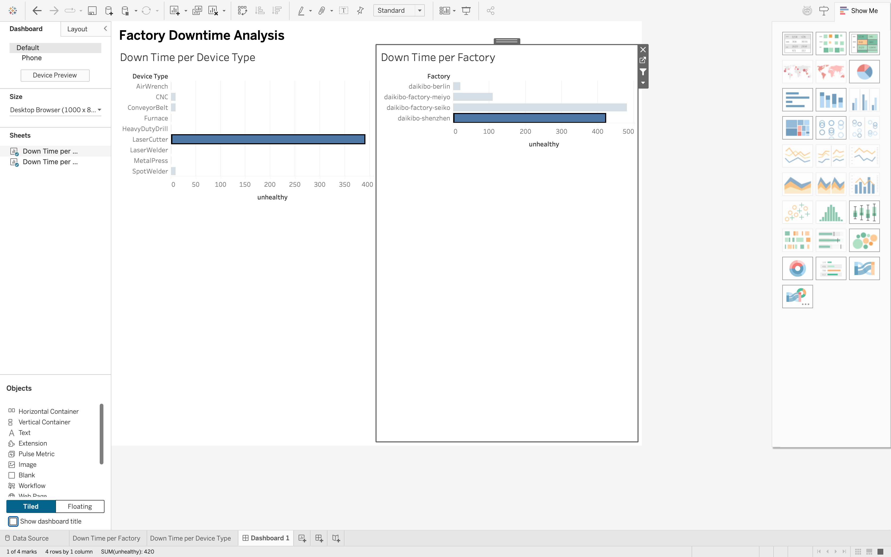

# Daikibo Factory Downtime Analysis

**Tableau | Data Analysis | Data Visualisation**

An analysis of Daikibo manufacturing telemetry data completed as part of the **Deloitte Australia Data Analytics Job Simulation on Forage**.

## 📊 Dashboard

The dashboard compares potential downtime across factories and allows users to select a factory to investigate downtime by device type.

## 🔎 Key Insights

* **Daikibo Seiko:** 410 minutes
* **Daikibo Shenzhen:** 410 minutes
* **Daikibo Meiyo:** 110 minutes
* **Daikibo Berlin:** 20 minutes

**Seiko and Shenzhen recorded the highest potential downtime**, making them the priority areas for further investigation.

## 🛠️ Tools

* Tableau
* Data visualisation
* Interactive dashboarding
* Data analysis

## 📌 Project Focus

The analysis was designed to answer two questions:

1. Which Daikibo factory has the highest potential downtime?
2. Which device types contribute to downtime within each factory?

An interactive filter connects the two charts, allowing users to select a factory and explore its device-level downtime.

## 📁 Files

* `dashboard/` — Dashboard screenshot
* `tableau/` — Tableau workbook

## 📚 Source

**Deloitte Australia Data Analytics Job Simulation — Forage**

The original simulation dataset is not included in this repository.
